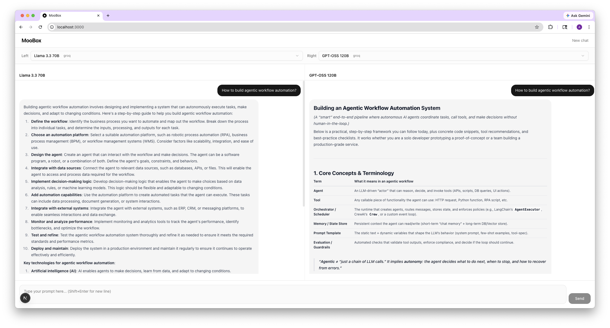

# MooBox

Side-by-side AI model comparison sandbox for internal teams. Send one prompt, see two models respond in real time.



## Architecture

- **Backend** — Python / FastAPI with [LiteLLM](https://github.com/BerriAI/litellm) for unified multi-provider streaming
- **Frontend** — Next.js / React with Tailwind CSS and shadcn/ui
- **Streaming** — Server-Sent Events (SSE) multiplex two model responses over a single connection

## Quick Start (local)

### Prerequisites

- Python 3.11+
- Node.js 20+
- API keys for the providers you want to use

### 1. Backend

```bash
cd backend
cp .env.example .env        # fill in your API keys
pip install -r requirements.txt
uvicorn app.main:app --reload --port 8000
```

### 2. Frontend

```bash
cd frontend
cp .env.local.example .env.local
npm install
npm run dev
```

Open [http://localhost:3000](http://localhost:3000).

## Quick Start (Docker)

```bash
# Create your env file
cp backend/.env.example backend/.env   # fill in API keys

docker compose up --build
```

- Frontend: http://localhost:3000
- Backend API: http://localhost:8000

## Model Registry

Models are configured in `backend/models.yaml`. Each entry specifies:

| Field          | Description                                                        |
| -------------- | ------------------------------------------------------------------ |
| `id`           | Model identifier passed to LiteLLM (e.g. `gpt-4o`, `claude-sonnet-4-20250514`) |
| `name`         | Display name shown in the UI                                       |
| `provider`     | LiteLLM provider key (`openai`, `anthropic`, `gemini`, etc.)       |
| `api_key_env`  | Environment variable name holding the API key                      |
| `api_base_env` | (Optional) Environment variable for a custom API base URL          |

### Adding an in-house model

If your model is served behind an OpenAI-compatible API (vLLM, TGI, LiteLLM proxy):

```yaml
- id: "internal/my-model"
  name: "My Model"
  provider: "openai"
  api_base_env: "MY_MODEL_API_BASE"
  api_key_env: "MY_MODEL_API_KEY"
```

Then set the corresponding env vars in `backend/.env`.

## Environment Variables

### Backend (`backend/.env`)

| Variable            | Required | Description                        |
| ------------------- | -------- | ---------------------------------- |
| `OPENAI_API_KEY`    | Per model | OpenAI API key                    |
| `ANTHROPIC_API_KEY` | Per model | Anthropic API key                 |
| `GOOGLE_API_KEY`    | Per model | Google AI API key                 |
| `INTERNAL_API_KEY`  | Per model | API key for in-house endpoint     |
| `INTERNAL_API_BASE` | Per model | Base URL for in-house endpoint    |
| `CORS_ORIGINS`      | No       | Comma-separated allowed origins (default: `http://localhost:3000`) |

### Frontend (`frontend/.env.local`)

| Variable               | Required | Description                     |
| ---------------------- | -------- | ------------------------------- |
| `NEXT_PUBLIC_API_URL`  | No       | Backend URL (default: `http://localhost:8000`) |

## API Endpoints

| Method | Path          | Description                          |
| ------ | ------------- | ------------------------------------ |
| GET    | `/api/models` | List available models                |
| POST   | `/api/chat`   | Stream side-by-side chat completions |

### POST `/api/chat`

Request body:

```json
{
  "messages": [{ "role": "user", "content": "Hello" }],
  "left_model": "gpt-4o",
  "right_model": "claude-sonnet-4-20250514"
}
```

Response: SSE stream with events like:

```
data: {"panel": "left", "delta": "Hello"}
data: {"panel": "right", "delta": "Hi there"}
data: [DONE]
```

## Project Structure

```
moobox/
├── backend/
│   ├── app/
│   │   ├── main.py              # FastAPI app, CORS, lifespan
│   │   ├── config.py            # Settings via pydantic-settings
│   │   ├── models_registry.py   # YAML model registry loader
│   │   ├── routers/
│   │   │   ├── chat.py          # POST /api/chat (SSE streaming)
│   │   │   └── models.py        # GET  /api/models
│   │   └── services/
│   │       └── llm.py           # LiteLLM parallel streaming
│   ├── models.yaml              # Model definitions
│   ├── requirements.txt
│   ├── Dockerfile
│   └── .env.example
├── frontend/
│   ├── src/
│   │   ├── app/
│   │   │   ├── layout.tsx
│   │   │   └── page.tsx         # Main sandbox page
│   │   ├── components/
│   │   │   ├── ChatPanel.tsx
│   │   │   ├── ModelSelector.tsx
│   │   │   ├── PromptInput.tsx
│   │   │   └── MessageBubble.tsx
│   │   └── lib/
│   │       ├── api.ts           # SSE client
│   │       └── types.ts         # Shared types
│   ├── package.json
│   ├── Dockerfile
│   └── .env.local.example
├── docker-compose.yml
└── README.md
```

## AI Assistance Disclosure

Portions of this project were developed with the assistance of AI-based tools. 
All generated code was reviewed, modified, and validated by the author.

## License

This project is licensed under the Apache License 2.0.

See the [LICENSE](/LICENSE) file for details.
